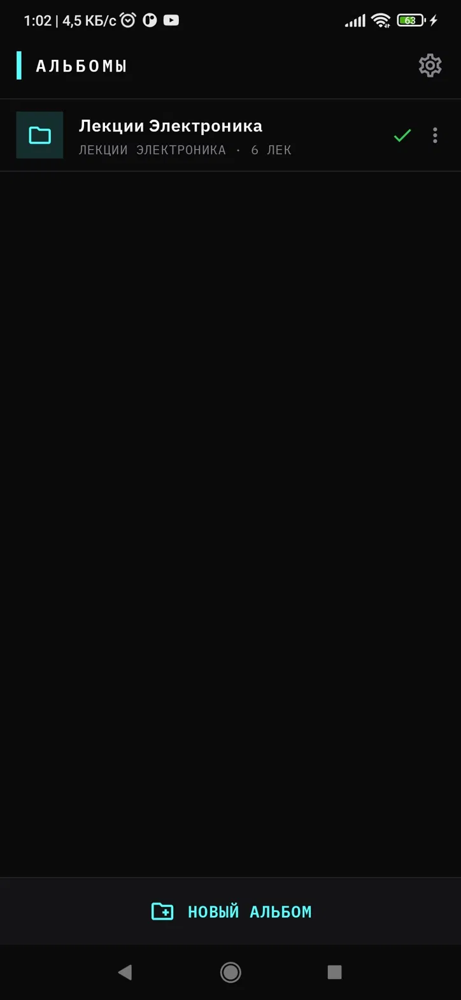
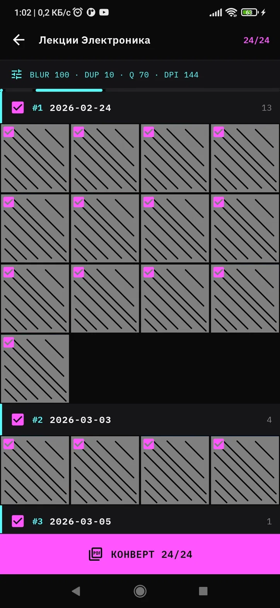
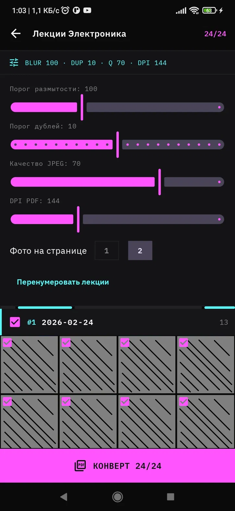
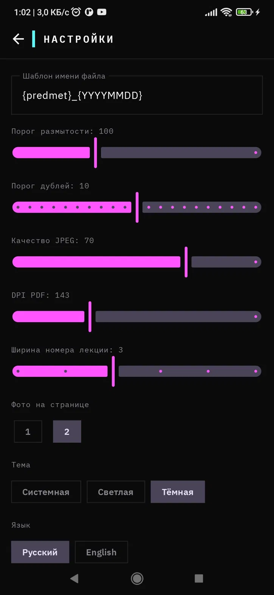
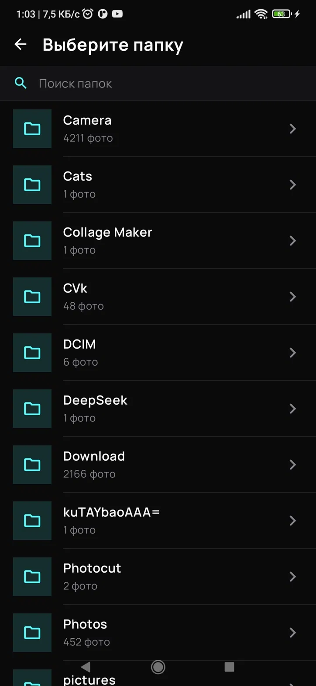

[Русский](README.md) | [English](README_EN.md)

# KebuzLect Mobile

Превращает папки с фото лекций в аккуратные PDF-файлы - прямо на телефоне, без проводов и компьютера.

Мобильная версия [KebuzLect Desktop](https://github.com/Kebuzya/KebuzLect).

## Скриншоты

| Альбомы | Альбом | Настройки альбома |
|---|---|---|
|  |  |  |

| Настройки | Выбор папки |
|---|---|
|  |  |

## Что умеет

**Работа с альбомами**
- Читает папки с фото из галереи телефона - одна папка на предмет
- Группирует фото по датам автоматически, один день = одна лекция
- Запоминает сконвертированные лекции - не предлагает повторять работу

**Просмотр и редактирование**
- Полноэкранный просмотр фото - свайп между всеми фото всех дат подряд
- Поворот фото прямо в просмотрщике (по часовой и против)
- Удаление ненужных фото с телефона прямо из приложения
- Перестановка фото внутри лекции и между датами (drag-and-drop)
- Закрытие просмотра свайпом вниз

**Отбор фото**
- Автоопределение размытых кадров (алгоритм Лапласиана)
- Автоопределение дублей (перцептивный хеш)
- Настраиваемые пороги прямо в экране альбома - результат виден мгновенно
- Чекбоксы для каждого фото и каждой даты - выбирай что войдёт в PDF

**Конвертация**
- Экспорт в PDF: 1 или 2 фото на лист A4
- Настраиваемое качество JPEG и DPI
- Собственный PDF-движок без сторонних библиотек - JPEG встраивается напрямую
- Шаблон имени файла с токенами ({predmet}, {YYYYMMDD}, {lection_number})

**Интерфейс**
- Светлая, тёмная и системная тема
- Интерфейс на русском и английском
- Поддержка Android 7.0+

## Установка

Скачай APK из раздела [Releases](https://github.com/Kebuzya/KebuzLectMobile/releases) и установи на телефон.

При первой установке Android может попросить разрешить установку из неизвестных источников - это нормально для APK вне Play Store.

## Как использовать

1. Открой приложение и нажми "Новый альбом"
2. Выбери папку с фото лекций из галереи
3. Приложение автоматически сгруппирует фото по датам
4. При необходимости сними галочки с ненужных фото
5. Нажми "Конверт" - выбери папку для сохранения PDF

## Шаблон имени файла

Настраивается в разделе "Настройки":

| Токен | Значение |
|---|---|
| `{predmet}` | Название альбома |
| `{YYYYMMDD}` | Дата лекции |
| `{lection_number}` | Порядковый номер лекции |

Пример: `{predmet}_{YYYYMMDD}` - `Электроника_20260224.pdf`

## Сборка из исходников
git clone https://github.com/Kebuzya/KebuzLectMobile.git

Открой в Android Studio, подключи телефон и нажми Run.

Требования: Android Studio Hedgehog или новее, JDK 11+.

## Связанные проекты

- [KebuzLect](https://github.com/Kebuzya/KebuzLect) - десктопная версия для Windows, подключается к телефону через USB/ADB

## Лицензия

MIT - см. [LICENSE](LICENSE).